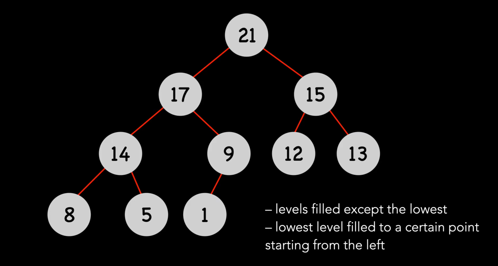
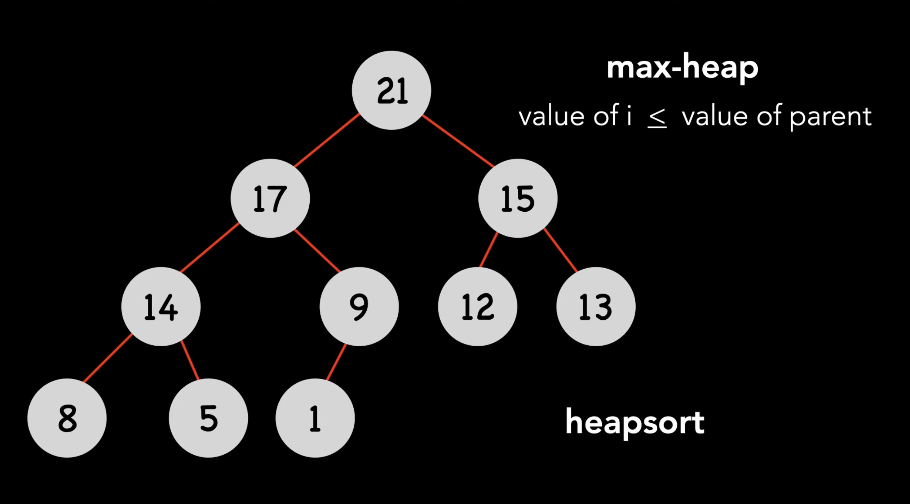
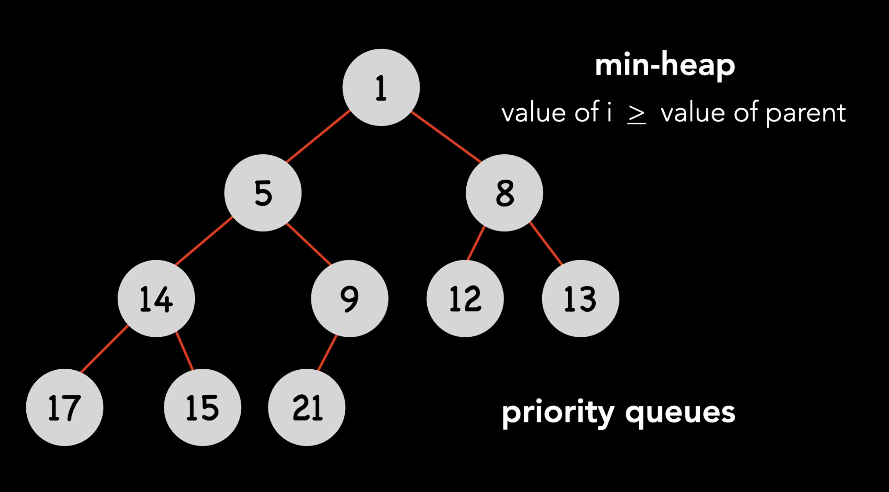

### What is a Heap? 

This is a data structure to manage information. They are sometimes called a `binary heap` and they can be described as a <b>"nearly complete binary tree".</b>. 

Heaps are usually implemented using `arrays[]`. 

As we can see, all the levels are filled except the lowest level. Also, we we add lower level nodes, we must fill the left most side first. 

 

There are two types of heaps: 

1. <b>Max-heap:</b> A max-heap is a binary heap where every parent’s value is greater than or equal to its children’s values.
This guarantees that the maximum element is always at the root.

    - `Heapsort` is a comparison-based sorting algorithm that uses a max-heap to sort an array.

    - In heapsort, the maximum element at the root is swapped with the last index of the array, where it becomes fixed in its final sorted position.

    - The heap size is then reduced, and the heap property is restored.

    - Heapsort is useful because it guarantees `O(n log n)` time complexity in all cases and sorts in place using O(1) extra memory.

    

2. <b>Min-heap:</b> A min-heap is a binary heap where every parent’s value is less than or equal to its children’s values.
This guarantees that the minimum element is always at the root.

    - When removing the minimum element, the root is swapped with the last element, the last element is removed, and the heap property is restored.

    - Min-heaps are commonly used to implement `priority queues`, where the smallest (highest-priority) element must be accessed efficiently.

    