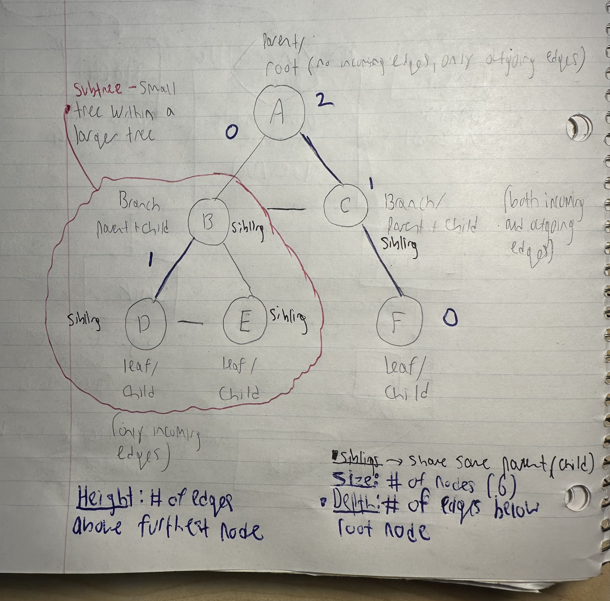

### What is a Tree? 

This is a non-linear (multiple paths, not a straight line) data structure where nodes are organized in a hierarchy. An example could be file explorer on windows. In one folder, you can have multiple sub folders and files. 

### What is a Binary Tree?

Well, lets take a look at a regular tree vs. a binary tree below: 

        A       
      / | \      
     B  C  D
       / \
      E   F

    -----------------------------------------------------------------------------------------------

      10      
     /  \
    5    15
     \
      7

For a regular tree, any node can have any number of children. The root node has 3 children and node C has 2 children. It is still a tree, but not a binary tree. Now for a binary tree, each node  can have at most 2 children. Node 10 has 2 children and node 5 has one child. 