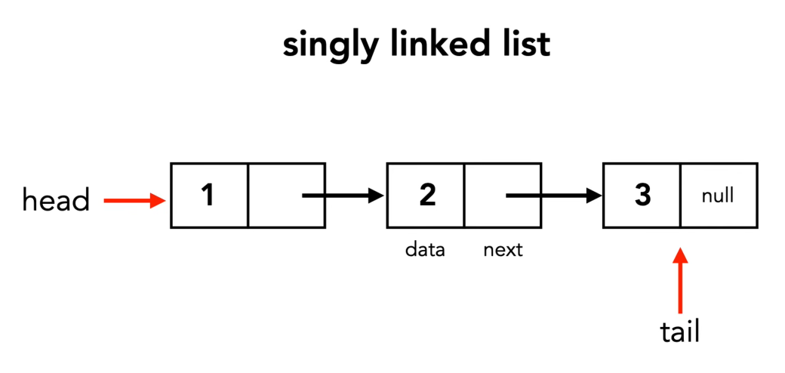
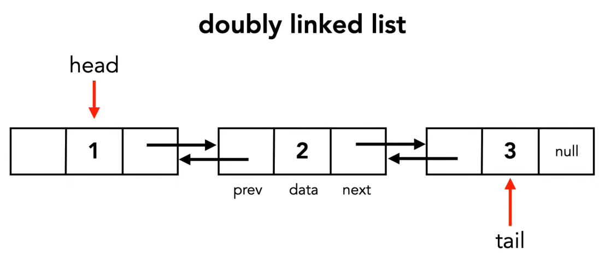
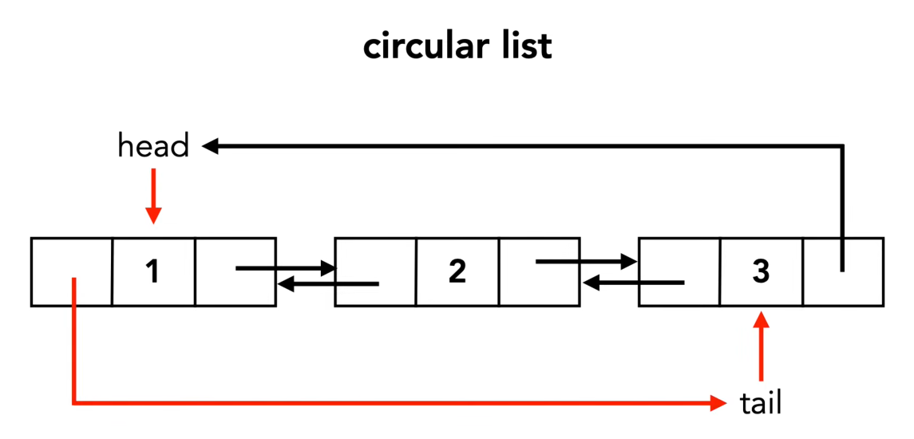

# Linked List 

A linked list is made up of <b>nodes</b>, where each node contains: 
1. `Data` (the value stored)
2. `Reference/Pointer` to another node 

## Singly Linked list 

Looking at this image, we can see that each object holds data and a next pointer. The first node is called the `Head` and last the node is called the `Tail`. 

This is an example of singly linked list as the pointers are going in one direction, so ach node points only to the next node. 

- Can only move forward.
- The last node's pointer is `null`.

## Doubly Linked list 

In a doubly linked list, each node, has two pointers: 
1. Pointer to the `next node` 
2. Pointer to the `previous node` 

    - Can move forward and back.
    - Requires extra memory because each node stores an additional pointer. 
    - For the `head` or first node, it does not usually point back. 

## Circular Linked List 

The last node points back to the first node instead of `null`

- Traversal can continue if we are not careful, meaning that there is no stopping condition implemented. 
- This is often used for round-robin scheduling and cyclic processes. 

## Circular Doubly Linked List

                ┌───────────────┐
                ↓               │
            [10] ⇄ [20] ⇄ [30]
            ↑                 ↓ 
            └─────────────────┘

Here, we can combine both implementations: 
- 10 → 20 
- 20 → 30 
- 30 → 10

Also: 
- 10 → 30 
- 30 → 20
- 20 → 10

## Common Operations 

### Search
- Find a node with a certain value. 
- For example if we wanted to search for `20` within `10 → 20 → 30`. We would start at `10`, move to `20`, found it. 

### Insert 
- Add a new node.
- Let's insert `15` between `10` and `20`. We now get `10 → 15 → 20 → 30`.

### Delete 
- Delete a specific node. 
- Let's delete `30`. We now get `10 → 15 → 20`. 