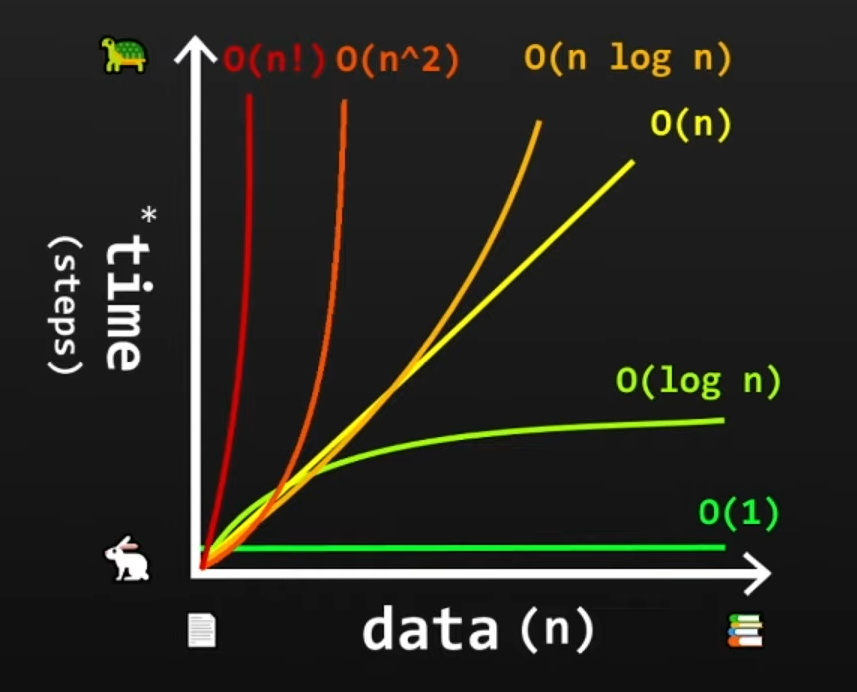

## What is Big O Notation? 
This is used to classify algorithms by how their runtime or space requirements grow as the input size <i>(n)</i> increases. 
<hr>

## Time Complexity
This tells us how much slower a piece of a program gets as the input gets larger, or in other words, it describes the performance of an algorithm as the amount of data increases.

### 1. O(1) - Constant Time

The runtime does not grow with <i>n</i>. For example, if we have a list of `[1,2,3,4]` and wanted to return list1[0], that is constant time. If <i>n</i> were to increase to `[1,2,3,4,5,6,7,8,9,10...],` the runtime will  still behave the same. 

- random access of an element in an array
- inserting at the beginning of a linkedlist 

### 2. O(log n) - Logarithmic Time

This means the work grows <b>very slowly</b> as  <i>n</i> grows. You still do more work, however, it is minimal. 

- <b>Binary Search</b> - If <i>n</i> is 32, there are about 5 comparisons. If  <i>n</i> is 1,024, there are about 10 comparisons. There is more work, but not that much. 

### 3. O(n) - Linear Time

The runtime grows <b>proportionally</b> with the input size <i>n</i>. If the input size doubles, the runtime roughly doubles and the same goes if it triples. Some examples include: 

- Looping through elements in an array
- Searching through a linkedlist 

### 4. O(n log n) - quasilinear Time

In this, you do <b>something linear (n)</b> and inside that process there is a <b>logarithmic factor (log n)</b>. For example, let's say we want to sort cards in a pile that are labeled 1 - 1000.

Each level doubles the number of piles, and each pile gets about half as big:

- Level 0: 1 pile of 1000

- Level 1: 2 piles of 500

- Level 2: 4 piles of 250

- Level 3: 8 piles of 125

- Level 4: 16 piles of 62–63

- Level 5: 32 piles of 31–32

- Level 6: 64 piles of 15–16

- Level 7: 128 piles of 7–8

- Level 8: 256 piles of 3–4

- Level 9: 512 piles of 1–2

- Level 10: 1024 piles of ~1 (you’ve basically reached single cards)

Now once every pile is size 1, each pile is <b>already sorted</b>, in which you can merge back together. This is done by comparing the both piles, and taking the smaller one. Some other types of sorts with this runtime include: 

- Quick sort
- Merges ort
- Heap sort 

### 5. O(n^2) - Quadratic Time

The work is <i>n</i> squared of n. For example, if <i>n</i> doubles, the work becomes about <b>4x</b> bigger. If <i>n</i> triples, the work becomes about <b>9x</b> bigger. An example could be the following: 

```python
nums = [1, 2, 3, 4, 5]
n = len(nums)

for i in range(n):
    for j in range(n):
        print(nums[i], nums[j])
```
Some type of sorts with this runtime are: 

- Bubble sort
- Selection sort 
- Insertion sort 

### 5. O(n!) - Factorial Time

For <b>small</b> <i>n</i>, factorial is okay, however, it explodes insanely fast as <i>n</i> grows. Note, that the factorial pattern goes like this `3! → 3 x 2 x 1 = 6`. Let's take a look at more examples: 

- 4! = 24 
- 5! = 120
- 6! = 720
- 7! = 5,040
- 8! = 40,320
- 9! = 362,880
- 10! = 3,628,800
- 13! = 6,227,020,800 (billon)

<b>O(n!)</b> is basically only usable for smaller inputs, anything larger is not efficient. 



One important aspect to note is that many algorithms still run very quickly on small datasets, even if their Big-O time complexity is higher.

However, as the input size grows, O(1) scales best, and algorithms like O(n), O(nlog⁡n), and especially O(n2) or O(n!) become much slower.


